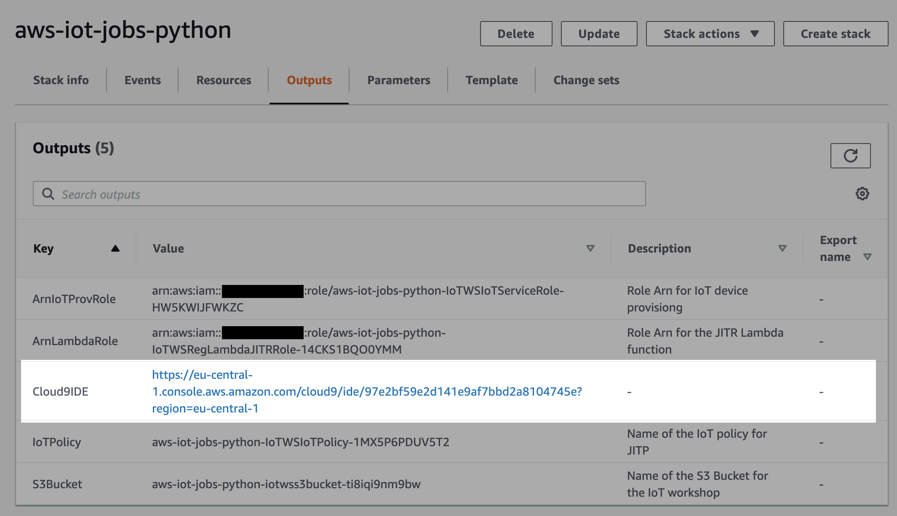
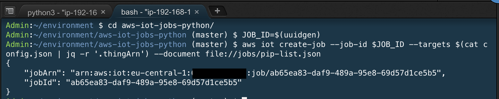
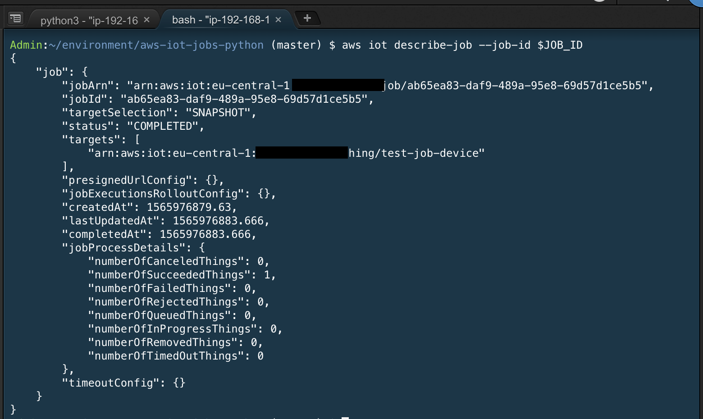
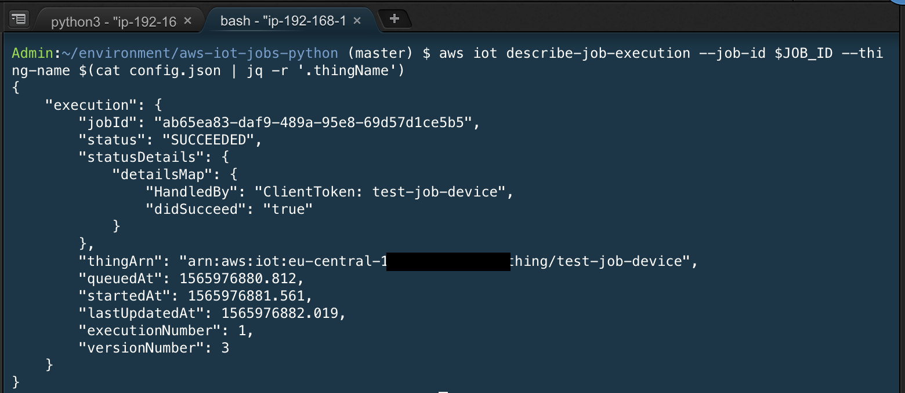
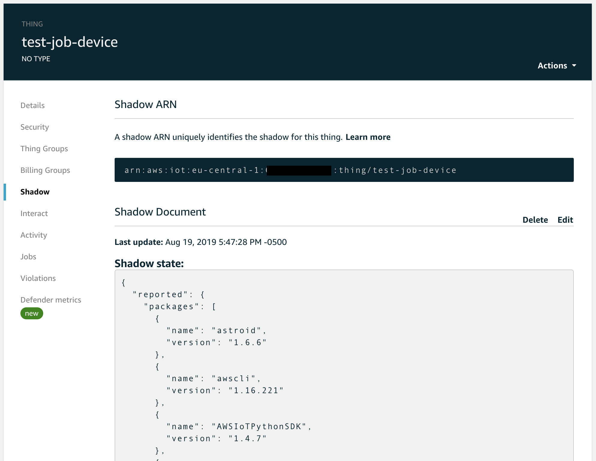
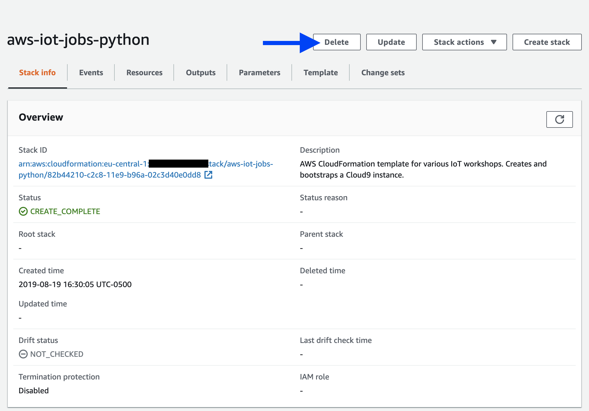

# aws-iot-jobs-python

This code sample demonstrates how a user can create/handle custom AWS IoT jobs in Python.

## License Summary

This sample code is made available under the MIT-0 license. See the LICENSE file.

## Setup

<details>
  <summary>Cloud9 IDE</summary>
  
### Compatible regions
  
* **ap-northeast-1** (Tokyo)
* **ap-southeast-1** (Singapore)
* **eu-central-1** (Frankfurt)
* **eu-west-1** (Ireland)
* **us-east-1** (N Virginia)
* **us-east-2** (Ohio)
* **us-west-2** (Oregon)

### Download zip and template

* [Download Lambda zip package](https://github.com/aws-samples/aws-iot-jobs-python/raw/master/c9_bootstrap_lambda/c9_bootstrap_lambda.zip)
* <a href="https://raw.githubusercontent.com/aws-samples/aws-iot-jobs-python/master/aws-iot-jobs-python.yaml" download>Download CloudFormation template</a>

### Configure and launch stack


### Launch Cloud9 IDE

Click the Cloud9 IDE link:


</details>

<details>
  <summary>Manual</summary>

  ### Compatible regions ###
  See the [AWS Region Table](https://aws.amazon.com/about-aws/global-infrastructure/regional-product-services/) for the current list of regions for AWS IoT Core and AWS IoT Device Management.

  ### Required tools ###
  * Linux/macOS (this solution has not been tested on Windows)
  * Python 3.6 or newer
  * [awscli](https://aws.amazon.com/cli/)
  * [jq](https://stedolan.github.io/jq/)
  
  ### Setup environment ###

  *NOTE: Make sure you execute this from the aws-iot-jobs-python directory.*

  ```
  export REGION=<enter your region>
  export S3_BUCKET=<enter your bucket name>
  ./bin/create.sh
  ```

</details>

## Start job agent

In one terminal tab/window, run the following command:
```
cd aws-iot-jobs-python
python3 jobsSample.py -j ./config.json
```


<details>
  <summary>config.json</summary>

```
{
    "thingName": "<THING-NAME>",
    "thingArn": "<THING-ARN>",
    "region": "<REGION>",
    "deviceCertificatePath": "",
    "privateKeyPath": "",
    "rootCaPath": "",
    "endpoint": "<ENDPOINT>",
    "credentialsEndpoint": "<CREDENTIAL-ENDPOINT-PREFIX>",
    "roleAlias": "<ROLE-ALIAS>",
    "useWebsocket": "false",
    "port": 8883,
    "s3Bucket": "<BUCKET-NAME>
}
```

| Key  | Description |
| ------------- | ------------- |
| thingName | provides identifier for thing; used as MQTT client ID |
| thingArn | Amazon Resource Name for thing |
| region | AWS region thing resides in |
| deviceCertificatePath | Path of device X.509 certificate |
| privateKeyPath | Path of device private key |
| rootCaPath | Path of Amazon CA certificate |
| endpoint | MQTT broker endpoint (in AWS IoT Core) |
| credentialsEndpoint | credentials endpoint (in AWS IoT Core) used to retrieve temporary credentials |
| roleAlias | used to retrieve temporary credentials with credentials endpoint |
| useWebsocket | determines if WS should be used |
| port | MQTT port |
| s3Bucket | used for uploading files |

</details>

<details>
  <summary>jobsSample.py</summary>

### About
Based on [jobsSample.py](https://github.com/aws/aws-iot-device-sdk-python/blob/master/samples/jobs/jobsSample.py) from [aws-iot-device-sdk-python](https://github.com/aws/aws-iot-device-sdk-python).  Modified to include jobExecutor, which handles the execution of specific job documents.

</details>

<details>
  <summary>jobExecutor.py</summary>

### About
Module referenced by [jobsSample.py](jobsSample.py) to handle specific job documents.  Can be modified to handle your custom jobs!

</details>

## Create jobs

In a separate terminal tab/window, run the following command:
```
cd aws-iot-jobs-python
JOB_ID=$(uuidgen)
aws iot create-job --job-id $JOB_ID --targets $(cat config.json | jq -r '.thingArn') --document file://jobs/pip-list.json
```



<details>
  <summary>Documentation</summary>

### Example job definitions
You can use the [JSON job documents](jobs/) to schedule a new job execution. You can find more info on each job type here:

#### Basic
* [download-files.json](docs/download-files.md)
* [install-packages.json](docs/install-packages.md)
* [pip-install.json](docs/pip-install.md)
* [pip-list.json](docs/pip-list.md)
* [pip-uninstall.json](docs/pip-uninstall.md)
* [rollback-files.json](docs/rollback-files.md)
* [run-commands.json](docs/run-commands.md)
* [uninstall-packages.json](docs/uninstall-packages.md)
#### Advanced
* [container-logs.json](docs/container-logs.md)
* [list-containers.json](docs/list-containers.md)
* [reboot.json](docs/reboot.md)
* [start-containers.json](docs/start-containers.md)
* [stop-containers.json](docs/stop-containers.md)
* [upload-files.json](docs/upload-files.md)
  
</details>

<details>
  <summary>Job Targets</summary>

### Summary
For the --targets parameter, you can use:
* An IoT Thing Arn
* An IoT Things Group Arn
* A local JSON file [targeting IoT Thing(s)](etc/target-thing.json), [targeting Things Group Arn(s)](etc/target-group.json), or targeting a combination of both!

#### Targeting a IoT Thing/Things Group Arn inline
```
aws iot create-job --targets {THING_OR_THINGS_GROUP_ARN} --document file://jobs/{JSON_JOB_DOCUMENT} --job-id $(uuidgen)
```

#### Targeting with a JSON file
```
aws iot create-job --targets file://etc/target-thing.json --document file://jobs/{JSON_JOB_DOCUMENT} --job-id $(uuidgen)
```

</details>

## Evaluate job status/execution

Execute the following to retrieve status details for your job:
```
aws iot describe-job --job-id $JOB_ID
```



Execute the following to retrieve specific job execution details for your thing:
```
aws iot describe-job-execution --job-id $JOB_ID --thing-name $(cat config.json | jq -r '.thingName')
```



After executing the pip-list job, notice that the device's shadow has been updated in AWS Management Console:



Or via CLI:

```
aws iot-data get-thing-shadow --thing-name $(cat config.json | jq -r '.thingName') shadow.txt
cat shadow.txt
```

## Clean up

<details>
  <summary>Cloud9 IDE</summary>

Go to CloudFormation, and delete the 'aws-iot-jobs-python' stack.



</details>

<details>
  <summary>Manual</summary>

### Delete environment

*NOTE: Make sure you execute this from the aws-iot-jobs-python directory. This script depends on values in config.json, which are populated from the create.sh script.*

```
export REGION=<enter your region>
./bin/delete.sh
```

</details>
